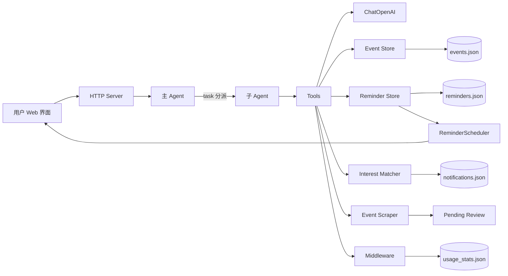

# 设计文档

## 1. 架构图

## 2. 模块职责

| 模块 | 职责 |
|---|---|
| `agent.py` | 主 Agent + 子 Agent：create_deep_agent 编排 5 个子 Agent、task 分派、10 次工具限制。 |
| `agent_tools.py` | 校园活动工具集：检索、提醒、偏好、抓取、待审核、统计。 |
| `event_store.py` | 加载、校验、全文检索、类别筛选、时间范围筛选。 |
| `time_parser.py` | 将中文时间表达解析为 ISO 日期时间范围，支持学期周、相对时间、自然语言时段。 |
| `scraper.py` | 拉取 feed、解析字段、去重、失败记录与人工审核。 |
| `reminder_store.py` | 保存提醒，按时间判断是否到期。 |
| `scheduler.py` | 后台调度：定时抓取和到点提醒检查。 |
| `interest_matcher.py` | 兴趣子 Agent：任一标签命中即生成推送、维护已读状态。 |
| `middleware.py` | 统计工具和 LLM 调用次数、耗时、Token。 |
| `server.py` | 提供 REST API 和静态页面。 |

## 3. 数据流

1. 用户输入进入 `CampusAgent.chat`。
2. 主 Agent 由 `create_deep_agent` 驱动，通过 task 把任务分派给对应子 Agent，由子 Agent 调用工具。
3. 工具调用次数通过 `ToolCallLimitMiddleware` 限制为 10 次。
4. 活动检索、时间解析等确定性能力继续由 `event_store` / `time_parser` 提供。
5. 抓取流程仍从 feed 读取候选，解析成功的入库，缺字段或时间无法解析的进入待审核。
6. 新入库活动经过兴趣匹配，命中任意一个用户标签则写入通知。
7. 提醒和会话历史写入 JSON，实现长期记忆。
8. ReminderScheduler 定时把到期提醒置为 notified，前端轮询后显示到点提醒条。

## 4. 技术选型

- Python 标准库 + LangChain：核心检索规则仍可复现；已使用 deepagents `create_deep_agent` 接入主 Agent + 5 个子 Agent 的多智能体编排，后续可扩展 RAG。
- JSON 文件存储：数据量小、可读、便于人工复核，符合课程验收要求。
- 自研规则解析：时间解析和检索逻辑可复现、可测试，不依赖 LLM 的随机性。
- LangChain ChatOpenAI：兼容 LM Studio 和 OpenAI 接口，LLM 为必选，调用失败时返回可读错误提示。
- HTTP + 原生前端：无需 Gradio/Streamlit 也能提供可用界面，同时降低环境风险。
- 检索与向量化选型：本项目暂不启用 Chroma/RAG。当前活动量为 39 条，关键词检索足以支持全文、类别和时间范围查询，且结果可复现、可离线验收；已有 7 个确定性工具满足“至少 3 个工具”的底线。若后续活动量变大或需要语义查询，再引入 Chroma 作为第二路召回，并保留规则检索保证结果可解释。

## 5. 关键设计决策

- `第 X 周` 必须有学期起点，默认 `2026-08-31`，可通过环境变量调整。
- 活动字段统一为名称、标准化时间、地点、类别、来源，输出格式稳定。
- 抓取失败不静默：写入日志并进入人工确认，满足 HITL 场景。
- 兴趣标签和提醒使用 JSON 长期记忆，重启后仍保留。
- 兴趣匹配采用“任一标签命中即推送”，不设匹配度阈值，避免多标签用户漏推。
- 到点提醒由后台线程驱动，前端轮询展示；提醒状态持久化，重启后不会重复触发。
- Agent 每次运行通过 `ToolCallLimitMiddleware` 限制最多 10 次工具调用。
- 技术底线对应：提供 9 个确定性工具并分派给 5 个子 Agent，使用 ToolCallLimitMiddleware 限制单轮最多 10 次工具调用；抓取解析失败写入日志并进入人工审批；中间件记录 Agent 与工具调用统计；数据清洗规则记录在 `cleanup_notes.md`。
