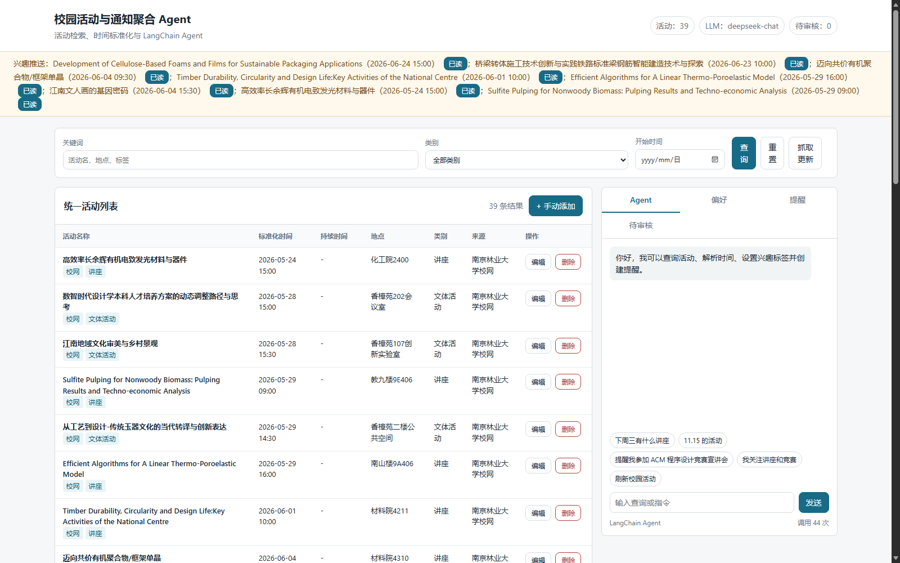

# 校园活动与通知聚合 Agent

## 项目介绍

本项目实现选题 6：校园活动与通知聚合 Agent。系统汇集校园讲座、竞赛、社团招新、教务通知、文体活动、志愿服务等通知，支持全文检索、类别筛选、时间范围筛选，并把 `第 X 周周三`、`11.15`、`周三下午`、`本月`、`下周` 等自然语言时间统一成具体日期。

项目核心链路为：

`用户输入 -> 主 Agent -> task 分派子 Agent -> 工具调用 -> ChatOpenAI -> 输出`

活动检索、时间解析、提醒、兴趣匹配、抓取去重和人工审核由确定性工具实现。右侧主 Agent 使用 deepagents `create_deep_agent` 编排 5 个子 Agent（活动查询/提醒/兴趣偏好/抓取与审核/活动管理），子 Agent 调用各自的工具，每次请求最多调用 10 次；LLM 为运行前提，调用失败时返回明确错误提示。

## 文档索引

- `README.md`：项目说明、启动步骤、常见问题与运行截图。
- `DESIGN.md`：架构图、模块职责、数据流和技术选型。
- `REQUIREMENTS.md`：功能清单、用户场景和优先级。
- `ANALYSIS.md`：需求分析、用例描述、流程图和边界情况。
- `DEPLOY.md`：从零部署、配置说明和常见坑。
- `SUMMARY.md`：项目复盘与后续扩展。
- `cleanup_notes.md`：数据来源、清洗规则和样本量。
- `tests/test_cases.md`、`tests/test_results.md`：测试用例与测试结果。
- `.env.example`：密钥和配置样例。

## 已实现功能

- 25 条手工整理活动数据、14 条南林校网抓取活动，共 39 条，覆盖 6 个类别和多种时间格式；另有本地示例源 `data/feed_candidates.json`，点击“抓取更新”可演示新增、去重与人工确认（新增 2 条、跳过重复 1 条、待确认 1 条）。
- 自然语言时间解析：`第 X 周周 X`、`11.15`、`X月X日`、`周三下午`、`本周/下周/本月/下个月/明天/后天` 等。
- 全文检索、类别筛选、时间范围筛选，统一输出活动名称、标准化时间、地点、类别、来源。
- Deep Agent（多智能体）：右侧主 Agent 通过 task 把任务分派给活动查询、提醒、兴趣偏好、抓取与审核、活动管理 5 个子 Agent，覆盖活动检索、提醒、兴趣、抓取、待审核、统计以及手动新增/编辑活动等全部功能。
- 定时/手动抓取：默认解析南京林业大学活动预告页 HTML 内嵌数据，解析失败记录日志并进入人工确认；也可配置 JSON 或本地示例源。
- 兴趣匹配子 Agent：偏好页和对话都可自选标签，新活动抓取入库、人工审核入库后自动推送；命中任一标签即推送，不设匹配阈值。
- 长期记忆：提醒记录、兴趣标签、会话历史、通知记录均持久化到 JSON。
- 到点自动提醒：提醒写入 JSON 长期记忆，后台按配置间隔检查，到期后页面自动显示；点「完成」或「取消」即删除该提醒，超过保留期（默认 24 小时）自动清理，列表不再堆积历史记录。
- Web 界面：标准库 HTTP 服务，无第三方前端依赖。
- 手动活动管理：活动列表支持手动新增、编辑、删除；新增/编辑共用弹窗表单，支持填写持续时间（如 `90 分钟`、`1.5 小时`），删除前二次确认，删除时自动取消相关提醒并移除对应兴趣推送，避免悬空引用。

## 接口说明

写操作统一使用 POST + JSON body，与项目现有写接口风格一致：

| 接口 | 作用 | 请求体示例 |
|---|---|---|
| `POST /api/events` | 手动新增活动，ID 可省略 | `{ "name": "讲座", "time": "2026-09-01T10:00", "duration": "90 分钟", "location": "教五楼" }` |
| `POST /api/events/update` | 修改活动字段 | `{ "id": "EVT-041", "location": "图书馆" }` |
| `POST /api/events/delete` | 删除活动（级联删除提醒、移除通知） | `{ "id": "EVT-041" }` |

- 新增成功返回 `201` 与新活动 JSON；修改/删除成功返回 `{"ok": true}`，ID 不存在返回 `404`。
- 手动新增时 ID 自动生成为 `EVT-{最大编号+1}`，无需手工填写。
- 手动新增/编辑支持 `duration` 字段（如 `90 分钟`、`1.5 小时`、`2小时30分钟`），自动换算为活动时长；活动数据不再记录结束时间。
- 删除活动时，引用该活动的未完成提醒会被一并删除，对应兴趣推送会被移除。
- 提醒生命周期：创建后为 `pending`，到点由后台置为 `notified` 并在顶部提醒条展示；点「完成」或「取消」都会物理删除该提醒；若一直未处理，超过 `REMINDER_RETENTION_HOURS`（默认 24 小时）后由后台自动清理。

## 目录结构

```text
campus_event_agent/
├─ run.py                  # 启动入口
├─ src/                    # 核心模块
│  ├─ agent.py             # 主 Agent + 子 Agent 多智能体编排
│  ├─ agent_tools.py       # 校园活动工具集
│  ├─ time_parser.py       # 中文时间解析
│  ├─ event_store.py       # 活动数据与检索
│  ├─ scraper.py           # 抓取、去重、人工审核
│  ├─ njfu_feed.py         # 南林校网活动页解析
│  ├─ reminder_store.py    # 提醒长期记忆
│  ├─ interest_matcher.py  # 兴趣匹配与推送
│  ├─ middleware.py        # 调用统计中间件
│  └─ server.py            # HTTP API 与静态页面
├─ data/                   # 活动、偏好、提醒、待审核、示例源
├─ static/                 # 前端页面
├─ docs/                   # README 运行截图等文档资源
└─ tests/                  # 测试用例与测试结果
```

## 环境要求

- Python 3.10 及以上
- 可选：LM Studio 或任意 OpenAI 兼容 `/chat/completions` 接口

请先安装依赖：

```bash
pip install -r requirements.txt
```

LangChain 相关依赖需要 Python 3.10+。

## 启动方法

```bash
cd campus_event_agent
python run.py
```

浏览器打开：

```text
http://127.0.0.1:8000
```

常用命令：

```bash
# 校验数据
python run.py --validate

# 执行一次抓取
python run.py --fetch-once

# 指定端口启动
python run.py --port 8000

# 开启后台定时抓取
python run.py --auto-fetch
```

Deep Agent（主 Agent + 子 Agent）默认读取 `.env` 中的 LLM 配置，可复制 `.env.example` 为 `.env` 并填写：

```dotenv
LLM_BASE_URL=http://127.0.0.1:1234/v1
LLM_API_KEY=
LLM_MODEL=local-model
AUTO_REMINDER_ENABLED=true
AUTO_REMINDER_INTERVAL=30
```

没有 `.env` 或接口不可用时，聊天会返回 LLM 调用失败的错误提示；活动筛选等确定性功能不受影响。

## 小组分工

> 提交前请把成员 A/B/C 替换为小组真实姓名、学号和对应模块。

| 成员 | 负责模块 | 说明 |
|---|---|---|
| 申杰 | 数据整理、时间解析 | 活动数据字段设计与清洗 |
| 秦振邦| Agent、检索、提醒 | 核心工具与对话流程 |
| 唐焌曦| 抓取、人工审核、文档 | 数据源接入与测试 |

## 常见问题

- 端口被占用：换用 `python run.py --port 8001`。
- LLM 无响应：检查 `.env` 中的 `LLM_BASE_URL` 和模型服务；不配置也能运行。
- 抓不到新数据：确认 `EVENT_FEED_URL` 指向校网活动页或 JSON feed；离线演示可将其留空并使用本地 `feed_candidates.json`。
- 时间基准：`第 X 周` 以 `SEMESTER_START` 为学期第一周周一换算，默认 `2026-08-31`。

## 运行效果



运行 `python run.py` 后，浏览器打开 `http://127.0.0.1:8000`。页面左侧可筛选活动，右侧可进行 Deep Agent（多智能体）对话、查看提醒和待审核记录。


## 测试

时间解析专项使用 13 个固定表达验证，全部通过，准确率 100%，用例见 `tests/test_cases.md`。

```bash
python -m unittest discover -s tests -p 'test_*.py'
```

测试结果详见 `tests/test_results.md`。
