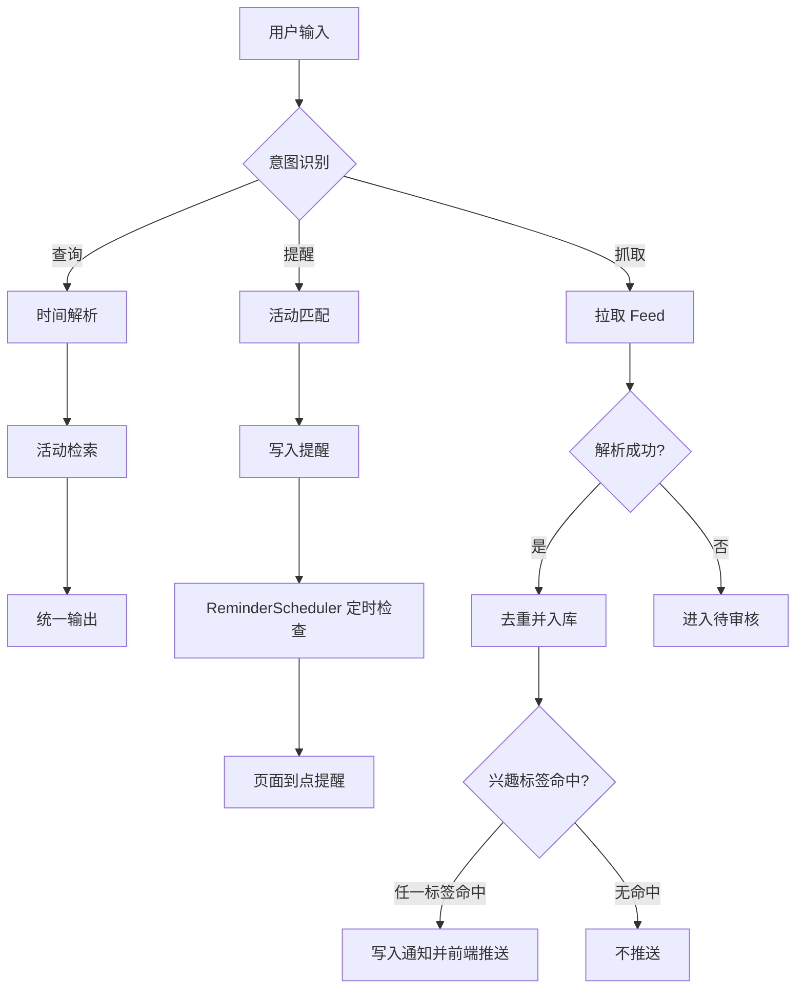

# 分析文档

## 1. 需求分析

选题 6 的核心问题是校园通知中的时间表达不统一。用户需要能直接问“下周”“第 X 周周三”“11.15”，而不是手动换算日期。因此本项目把“时间解析”作为独立工具实现，并把活动数据建模为统一字段。

## 2. 用例描述

### 用例 1：按自然时间查活动

- 输入：`第2周周三有什么讲座`
- 处理：解析 `第2周周三` 为 `2026-09-09`，类别为讲座。
- 输出：大学英语四级备考讲座，时间、地点、来源。

### 用例 2：创建提醒

- 输入：`提醒我参加 ACM 程序设计竞赛宣讲会`
- 处理：检索活动，写入 `reminders.json`。
- 输出：已创建提醒及活动时间，到期后后台自动置为已通知并显示在页面提醒条。

### 用例 3：抓取与人工确认

- 输入：点击“抓取更新”。
- 处理：读取 `feed_candidates.json`，新增 2 条、跳过重复 1 条、待确认 1 条。
- 输出：抓取结果；缺字段记录进入待审核面板。

### 时间解析验证

以 `2026-09-07` 为基准日期、`2026-08-31` 为学期起点，13 个固定时间表达全部通过，准确率 13/13 = 100%；完整预期与实际结果见 `tests/test_cases.md`。

## 3. 流程图

## 4. 边界情况分析

- 空输入：返回使用引导。
- 查询范围无活动：返回“没有找到”，不虚构结果。
- LLM 服务挂掉：降级到规则回复，界面仍可用。
- 提醒到期：后台线程或 API 请求将状态置为 notified，前端轮询显示提醒条；完成/取消后不再重复提醒。
- Feed 缺失名称/时间：进入人工确认，不直接写入。
- 重复活动：按 ID 去重，重复记录跳过。
- 兴趣匹配：多个标签时任一命中即推送，不需要设置匹配度阈值。
- 日期超界：时间解析返回 `None`，按关键词检索。

